# Mortgage Calculator

A web application to calculate loan repayment schedules with support for overpayments. Built using Python, `streamlit`,
`pandas`, `numpy_financial`, and `matplotlib`.

👉 [Polish version below](#kalkulator-kredytowy)

## ⚙️ Features

- Loan monthly payment calculation
- Handles overpayments (one-time, periodic, full-term)
- Generates visual amortization schedule
- Interactive UI built with Streamlit
- Summary of total loan cost and interest

## 🚀 Run Locally

### Option 1: Streamlit (Local)

```bash
    pip install -r requirements.txt
    streamlit run main.py
```

### Option 2: Docker image

1. Build Docker image:
   ```bash
   docker build -t mortgage-calculator .
   ```
2. Run container:
    ```bash
    docker run -p 8080:8080 mortgage-calculator
    ```

The app will be available at http://localhost:8080

## 🧪 Tests

Unit tests are written using `pytest`:

```bash
  pytest tests.py
```

## 📦 Requirements

Install dependencies with:

```bash
  pip install -r requirements.txt
```

## 🐳 Note

The .venv folder is excluded via .dockerignore – the local virtual environment is not copied into the Docker image.

## 📘 Sample Usage

After launching the application, the sidebar on the left will appear where you can select the loan amount, annual interest rate, and loan term:

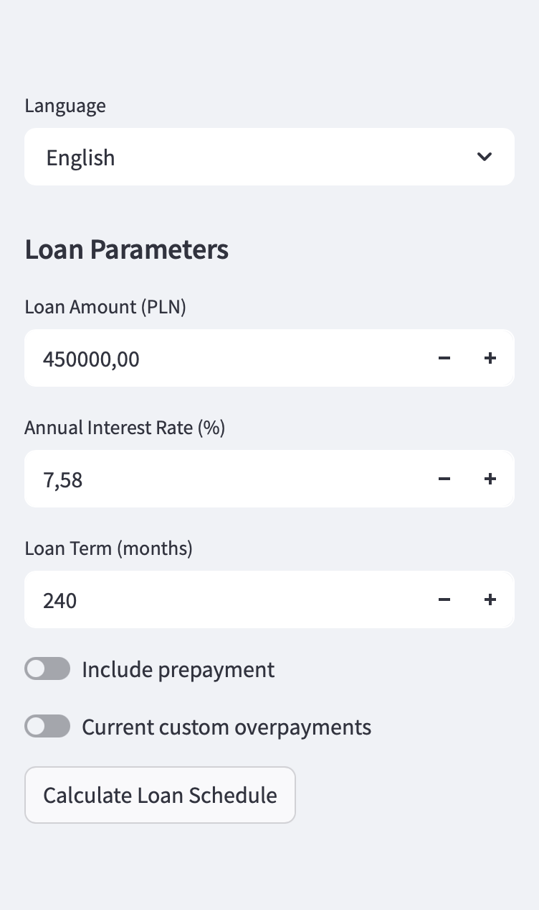

Below, you’ll also find options to analyze the loan with **prepayments**. You can choose prepayments over the entire loan period, with two available modes:
- fixed prepayment **without shortening the loan term**,
- fixed prepayment **that shortens the loan term**, keeping the monthly installment the same:

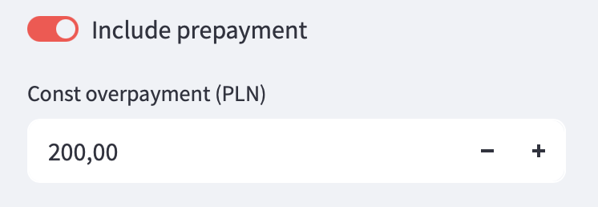

You can also define your own prepayments by creating a new set and giving it a name:

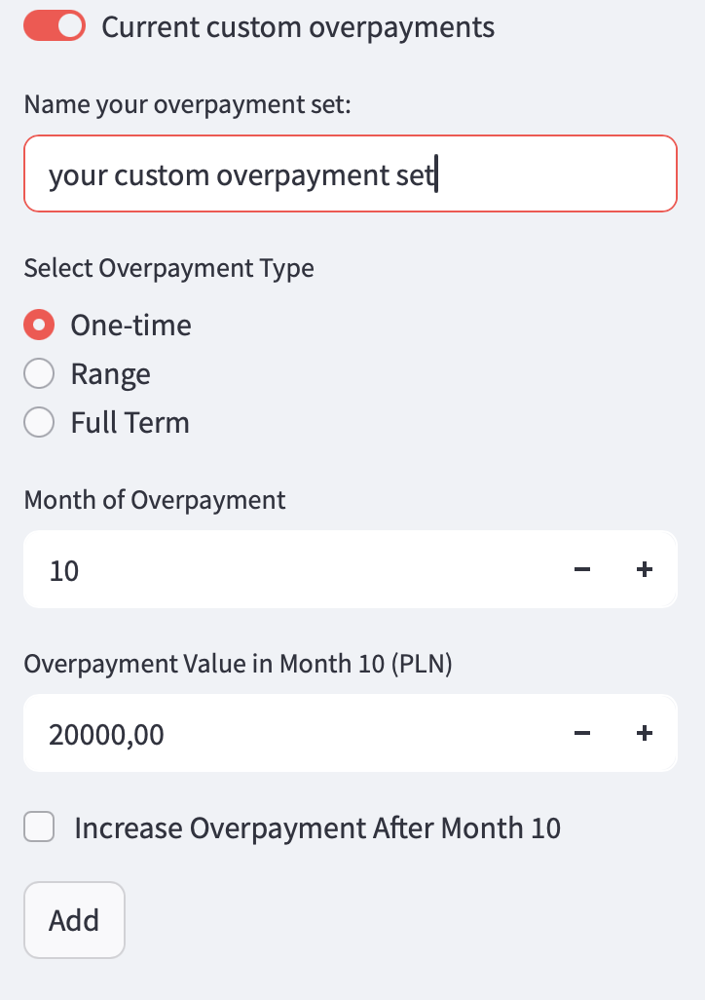

Then, choose the type of prepayment you want to add:

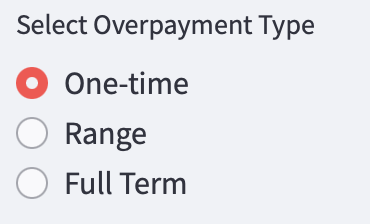

**One-time prepayment:**

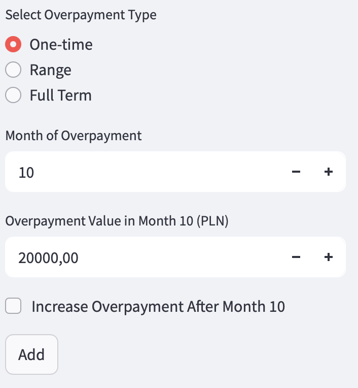

**Prepayments within a selected date range:**

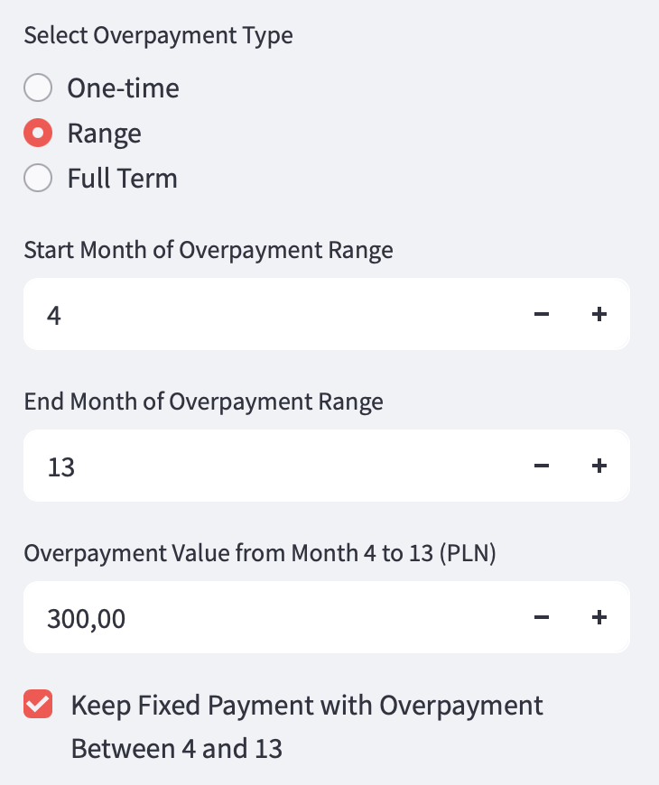

**Prepayments over the entire loan term:**

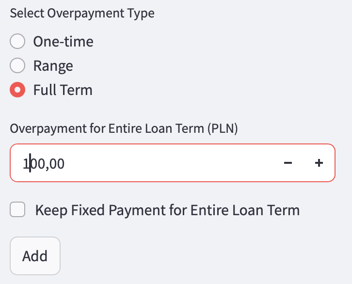

You can also choose whether prepayments should:
- **reduce the monthly installment** (default), or
- **shorten the loan term**, keeping the installment unchanged:


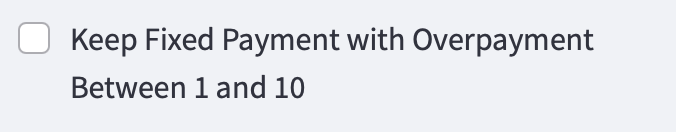
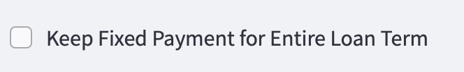

New prepayments can be added to an existing set or to a newly created one:

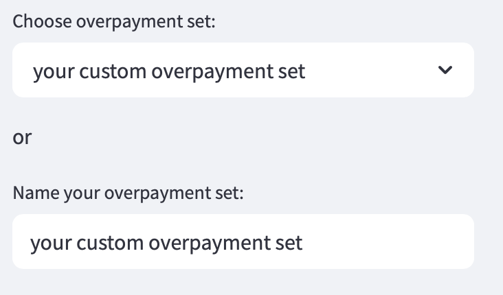

Below, the prepayment sets along with their individual entries will be displayed:

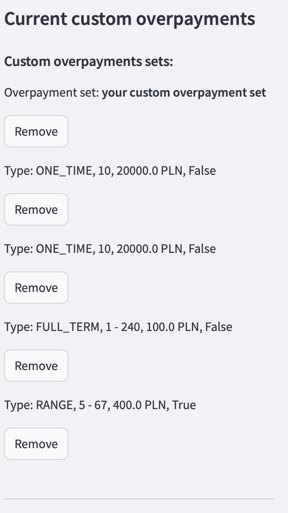  
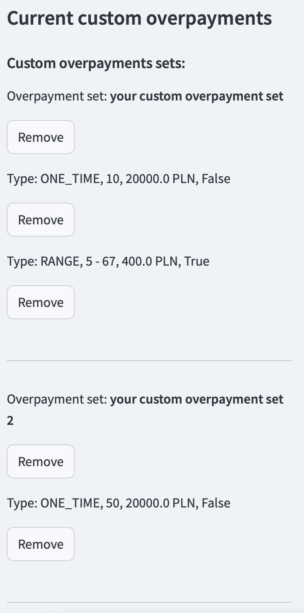

You can delete individual prepayments or the entire set.

Finally, you can **calculate a loan summary** for the selected options:

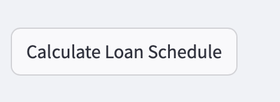

Loan details will appear in the center section of the screen:

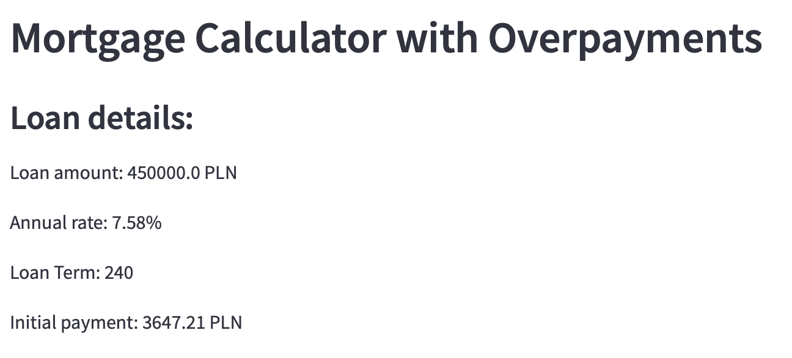

Along with a comparison of:
- **without prepayments**:  
  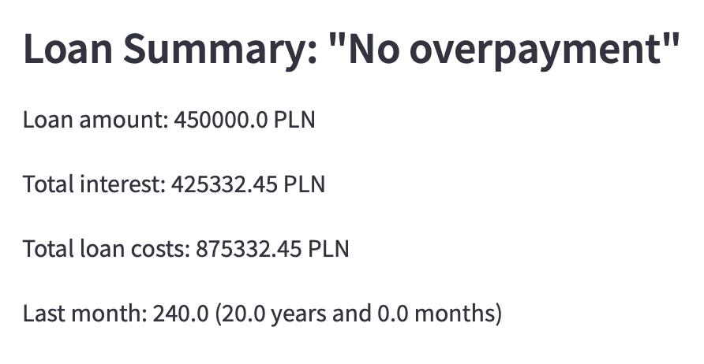
- **with fixed prepayments**:  
  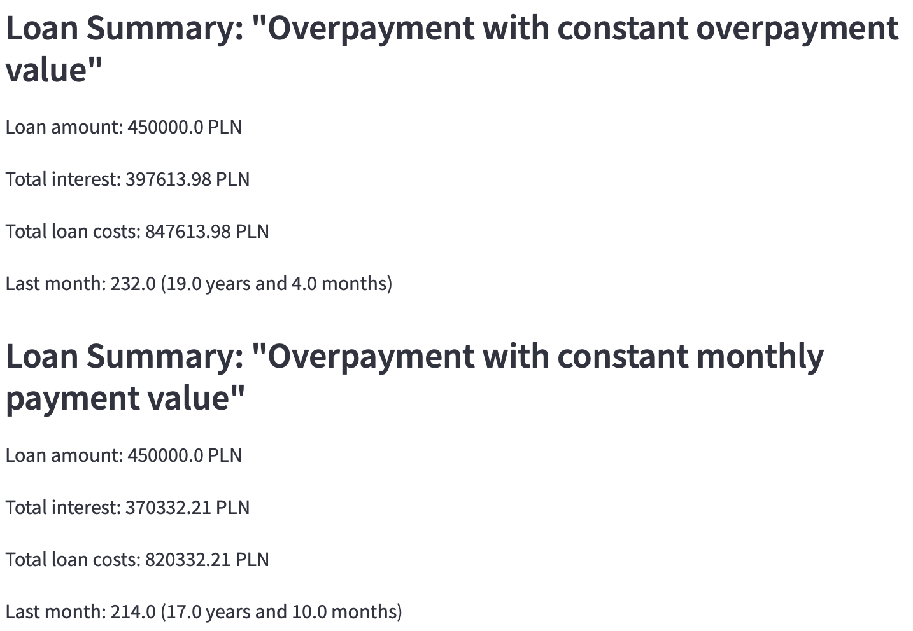
- **with custom prepayment sets**:  
  

**Repayment schedules** for each option:

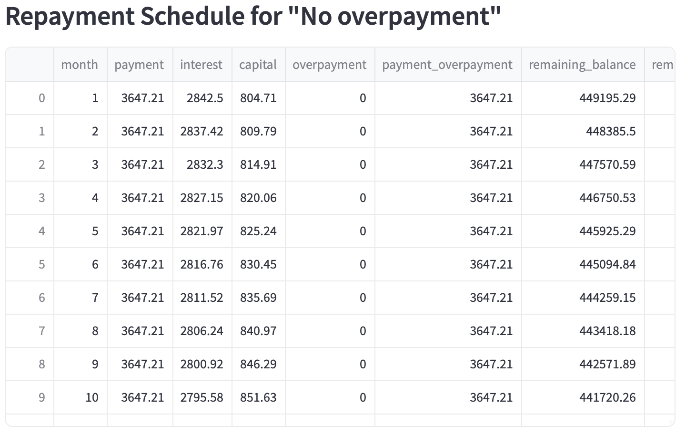

Comparison charts showing:
- capital repayment speed:  
  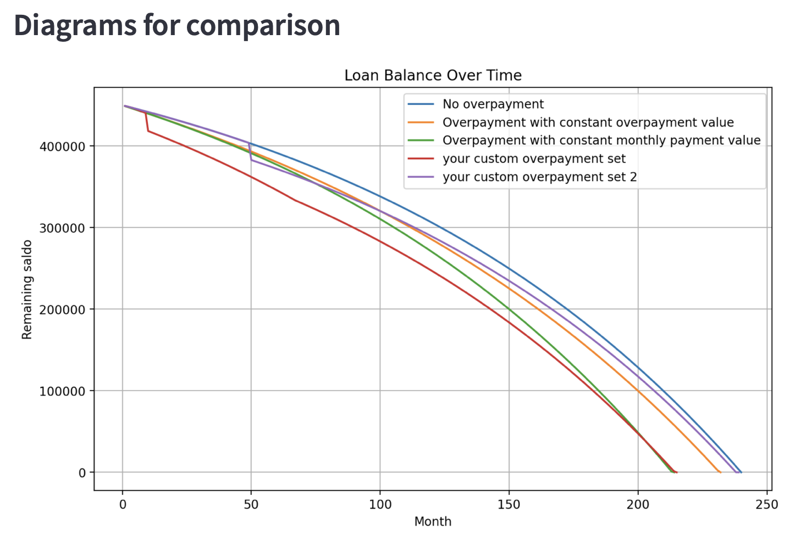
- total cost for each option:  
  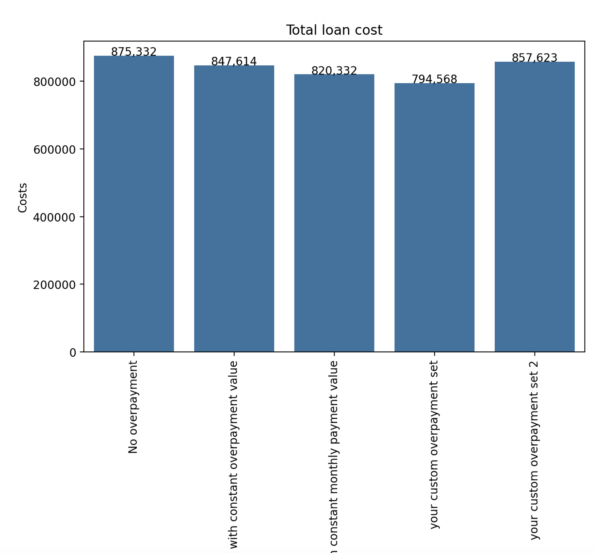

# Kalkulator Kredytowy

Aplikacja webowa do obliczania harmonogramu spłat kredytu z uwzględnieniem nadpłat. Wykonana w Pythonie przy użyciu
`streamlit`, `pandas`, `numpy_financial` i `matplotlib`.

## ⚙️ Funkcjonalności

- Obliczanie miesięcznej raty kredytu
- Obsługa nadpłat (jednorazowych, zakresowych, stałych)
- Interfejs w Streamlit
- Wykres harmonogramu spłat
- Podsumowanie kosztów i odsetek

## 🚀 Uruchamianie

### Opcja 1: Streamlit (Localnie)

```bash
    pip install -r requirements.txt
    streamlit run main.py
```

### Opcja 2: Docker

1. Zbuduj obraz Dockera:
   ```bash
   docker build -t mortgage-calculator .
   ```
2. Uruchom kontener:
    ```bash
    docker run -p 8080:8080 mortgage-calculator
    ```

Aplikacja będzie dostępna pod http://localhost:8080

## 🧪 Testy

Testy jednostkowe uruchomisz przy użyciu `pytest`

```bash
  pytest tests.py
```

## 📦 Wymagania

Wszystkie biblioteki znajdują się w pliku `requirements.txt`:

```bash
  pip install -r requirements.txt
```

## 🐳 Uwaga

Folder `.venv` jest ignorowany dzięki `.dockerignore` – nie trafia do obrazu Dockera.


## 📘 Przykładowe użycie

Po uruchomieniu aplikacji, z lewej strony pojawi się następujący sidebar, gdzie można wybrać kwotę kredytu, roczną stopę oprocentowania oraz okres kredytowania:


Poniżej pojawiają się również opcje analizy opłaty kredytu z **nadpłatami**. Masz do wyboru opcję nadpłaty w całym okresie kredytowania, rozpatrywaną w dwóch wariantach:
- nadpłacasz stałą kwotę **bez skracania okresu kredytowania**,
- nadpłacasz stale, **skracając okres kredytowania**, utrzymując wysokość raty:


Możesz też dodać swoje własne nadpłaty, tworząc nowy zbiór i nadając mu nazwę:


A następnie wybierając rodzaj nadpłaty, który chcesz dodać:


**Jednorazowa nadpłata:**


**Nadpłaty w podanym zakresie dat:**


**Nadpłaty w całym okresie kredytowania:**


Możesz również określić, czy nadpłaty mają:
- **obniżać ratę kredytu** (domyślnie),
- czy **skrócić okres kredytowania**, pozostawiając ratę bez zmian (różny opis w zależnie od typu nadpłat):


Nowe nadpłaty możesz dodać do już istniejącego zbioru lub utworzyć nowy:


Poniżej wyświetlone zostaną utworzone zbiory nadpłat wraz z ich zawartością:

  


Możesz usuwać pojedyncze nadpłaty lub całe zbiory.

Na koniec możesz **obliczyć podsumowania kredytu** dla wybranych opcji:


W środkowej części ekranu pojawią się szczegóły dotyczące kredytu:


Wraz z porównaniem opcji:
- **bez nadpłat**:  
  
- **z nadpłatą stałą**:  
  
- **z własnymi zbiorami nadpłat**:  
  

**Harmonogramy spłat** dla każdej opcji:


Wykresy porównujące:
- tempo spłaty kapitału:  
  
- całkowity koszt kredytu:  
  
